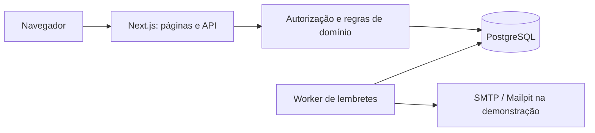
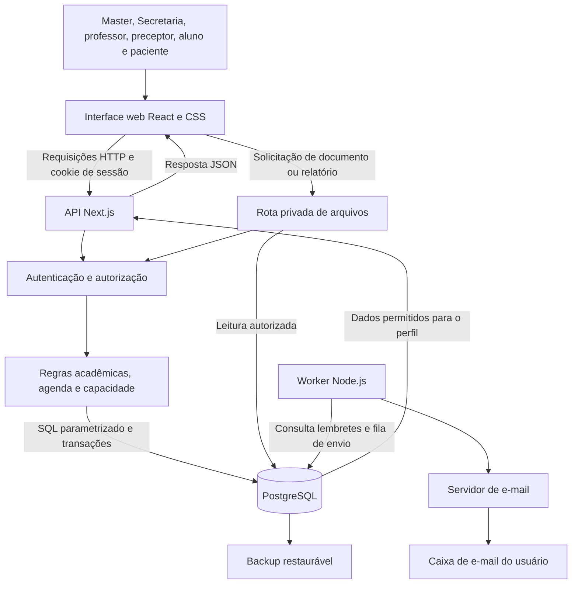
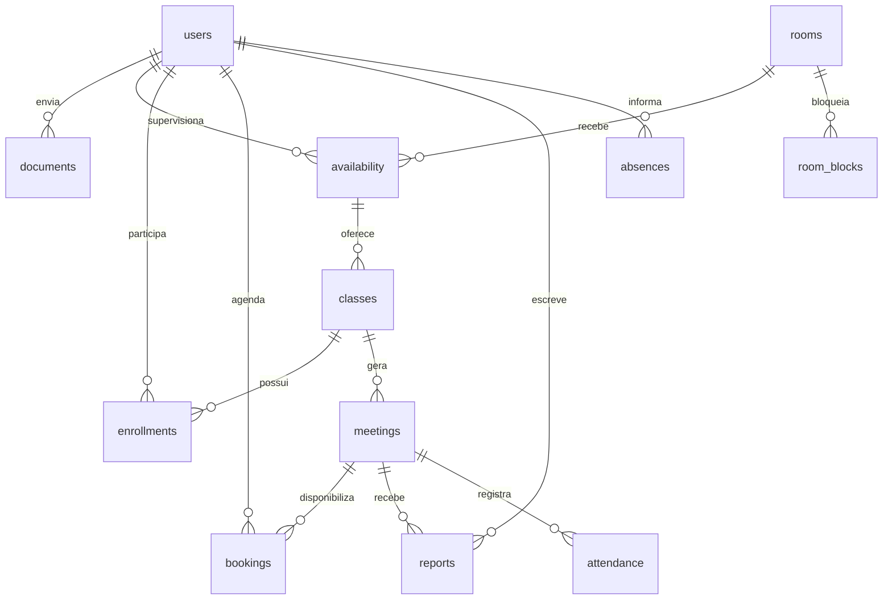

# Arquitetura, decisões e verificação

## Organização

Next.js 16, React 19 e TypeScript fornecem interface e API na mesma aplicação. PostgreSQL 17 é o banco do Docker. PGlite é apenas alternativa para desenvolvimento e testes isolados. `pg` utiliza consultas parametrizadas. Não há dependência de serviço externo para o núcleo de agendamento.

## Estrutura principal

### Conexões entre os componentes

A interface, API e rotas de arquivos pertencem à mesma aplicação Next.js. O worker é um processo separado que compartilha o PostgreSQL. Na demonstração local, o Mailpit recebe os e-mails; para entrega real das mensagens é necessário configurar um servidor SMTP.

Tabelas complementares: settings, sessions, resets, login_attempts, transfers, messages, notices, issues, outbox e audit. Vínculos encerrados preservam histórico. Substituição do professor mantém a turma e o acesso do sucessor aos relatórios.

## Concorrência e segurança

- Mutações PostgreSQL são serializadas com um advisory lock transacional. É uma escolha simples para a escala da Hackathon; a reserva verifica novamente a vaga dentro da transação.
- A transferência em lote retira as origens e verifica todos os destinos na mesma transação. Qualquer conflito desfaz tudo.
- Senhas têm salt e scrypt. O banco armazena o hash dos tokens de sessão/recuperação, não o token original. Recuperação revoga sessões existentes.
- Alterações exigem origem HTTP compatível com APP_ORIGIN, além da sessão. Cookies têm HttpOnly/SameSite; Secure é configurável conforme HTTPS.
- CPF/e-mail de login têm limitação de tentativas. Não é uma proteção distribuída contra abuso de cadastro público.
- Arquivos são retornados como download, com verificação de vínculo/permissão e limite de 5 MB. Formatos permitidos: PDF, PNG, JPEG, TXT. Não há antivírus integrado.
- Relatórios não armazenam CPF/contato como campos acadêmicos. Arquivos de texto livre podem conter dados inseridos pelo autor e precisam seguir orientação institucional.

## Padrões adotados para questões em aberto

1. Horário institucional: America/Sao_Paulo. A configuração inicial de relatório é 23h59. A primeira entrega atrasada do preceptor é permitida; alterações após o prazo não são.
2. Ausência do aluno dispensa envio. A frequência é confirmada pelo professor a partir do relato do preceptor; pendência anterior deve ser interpretada junto desse registro.
3. Consulta sem resposta de confirmação permanece agendada. O paciente pode recusar a primeira confirmação nas 24 horas anteriores; cancelamento normal respeita a antecedência configurada.
4. Encontros oferecem consultas de duração fixa definida pelo professor; o limite por horário é definido pelo preceptor e limitado pela estrutura física.
5. O conjunto de disciplinas concluídas informado pelo aluno é conferido pelo professor ao aprovar a documentação. Alteração acadêmica pelo aluno revoga a aprovação.
6. Semestre pode ser marcado como arquivado. A implementação preserva registros no banco; não exporta um arquivo morto independente.
7. Transferência sem vaga permanece encaminhada até uma oportunidade. O Master seleciona vários pedidos para efetivar trocas completas.

## Limites conhecidos a considerar na evolução

- Um único calendário de funcionamento institucional e uma capacidade global por configuração; salas possuem identificação de clínica. Unidades independentes com calendários diferentes exigem evolução do modelo.
- O modelo de equipamento é a quantidade de postos equipados por sala; não existe inventário individual ou especialização por tipo de equipamento.
- Redução de capacidade não remove alunos. Pode suspender novas vagas até ajuste; redistribuição automática não é executada.
- Mensagens são carregadas ao abrir/atualizar a página; não há chat em tempo real.
- Worker único: verifica a cada minuto. Após uma parada, envia o lembrete adequado à antecedência restante (72, 24 ou 5 horas), sem enviar as etapas anteriores já ultrapassadas. Chave de deduplicação impede novo enfileiramento da mesma etapa. Entrega SMTP pode repetir em uma falha entre envio e confirmação no banco.
- Horários de disponibilidades que já formaram turmas ficam preservados; para outra agenda, cria-se disponibilidade e turma novas e transfere-se o aluno. Não há reagendamento individual de encontro mantendo a mesma turma.
- A duração não muda quando a turma possui consultas no histórico. Isso preserva a interpretação dos horários antigos.
- Existe uma configuração institucional corrente de semestre; ainda não há versionamento completo de todas as configurações antigas. O backup preserva o estado integral no momento da exportação.
- Atendimento realizado é registrado nos relatórios, sem prontuário clínico, assinatura digital ou cobrança.
- Não há fila de espera automática para pacientes; cancelamentos institucionais aparecem como pendência prioritária para a Secretaria.
- Contas de demonstração compartilham senha intencionalmente. Isso não é configuração de produção.

## Critérios de aceitação

- Aluno sem aprovação não se inscreve e não gera vaga de consulta.
- Turma não ocupa preceptor/sala/professor já comprometidos no mesmo horário.
- Duas reservas concorrentes não consomem a mesma última vaga.
- Paciente não lê documentos acadêmicos ou relatórios de terceiros.
- Cancelamento do encontro cancela consultas e avisa Secretaria/pacientes.
- Relatório de aluno fora do prazo é bloqueado; o preceptor pode entregar atrasado uma vez.
- Transferência sem destino válido mantém o vínculo de origem.
- Docker inicia banco antes da aplicação e mantém dados após reinício.
