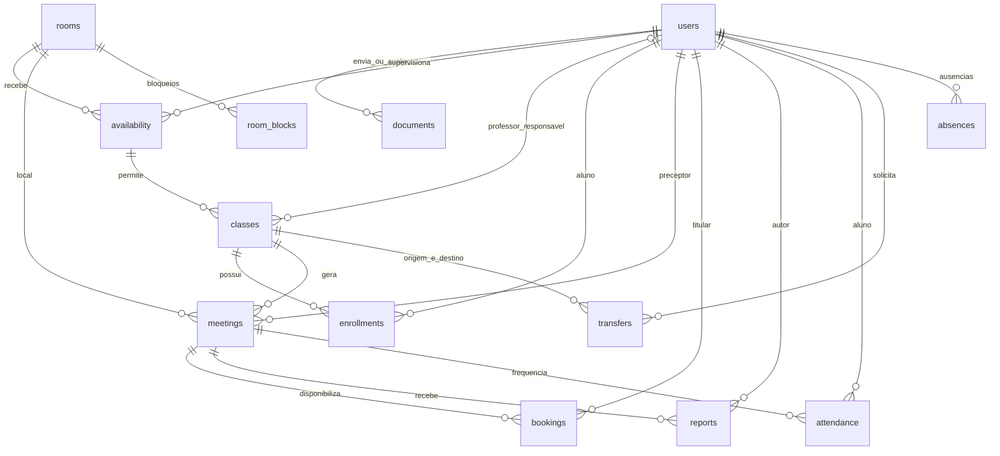

# Estrutura do banco de dados

O sistema utiliza PostgreSQL. A definição executável das tabelas, chaves, índices e restrições está em [database/schema.sql](../database/schema.sql). Os dados fictícios são gerados por [lib/seed.ts](../lib/seed.ts).

## Relacionamentos principais

O diagrama resume os relacionamentos acadêmicos e de atendimento. Uma linha representa um vínculo por chave estrangeira; uma entidade pode participar de vários registros. `professor_id` permite valor nulo quando uma turma está sem avaliador.

## Dicionário das tabelas

| Tabela | Dados e finalidade |
|---|---|
| settings | Um registro de configurações institucionais em JSONB. |
| users | Identificação, perfil, dados acadêmicos, aprovação, permissões e hash da senha. |
| sessions | Hash do token, usuário e vencimento da sessão. |
| resets | Hash do token de recuperação, usuário e vencimento. |
| login_attempts | Contagem e validade das tentativas de login. |
| rooms | Clínica, área, capacidades de alunos/pacientes e postos equipados. |
| availability | Preceptor, sala, dia da semana, intervalo e limites de supervisão. |
| classes | Curso, períodos, pré-requisitos, professor, disponibilidade, datas e semestre. |
| enrollments | Vínculo entre aluno e turma, situação e datas de início/encerramento. |
| meetings | Encontro datado da turma, preceptor, sala, limites, situação e motivo. |
| documents | Documento do aluno, arquivo, avaliação, comentário e avaliador. |
| bookings | Encontro, titular da reserva, paciente/acompanhado em JSONB, horário e situação. |
| reports | Arquivo por autor/encontro, comentário, atraso, frequência informada e atendimentos. |
| attendance | Presença ou ausência do aluno no encontro e professor que confirmou. |
| transfers | Aluno, turmas de origem/destino, motivo e situação do pedido. |
| issues | Autor, sala opcional, assunto, relato do problema e situação. |
| messages | Remetente, destinatário, assunto, conteúdo e data. |
| notices | Avisos por usuário e indicação de leitura. |
| outbox | Fila de e-mails, deduplicação, tentativas e data de envio. |
| audit | Usuário, ação, alvo e data do registro administrativo. |
| room_blocks | Sala, intervalo de datas e motivo do bloqueio. |
| absences | Usuário responsável e intervalo de ausência. |

## Integridade e armazenamento

As tabelas usam identificadores próprios e chaves estrangeiras para manter os vínculos. CPF e e-mail de usuários são únicos. Há restrição para impedir duas inscrições ativas do mesmo aluno na mesma turma, dois encontros da turma no mesmo dia e dois relatórios do mesmo autor no mesmo encontro.

Documentos e relatórios são armazenados em `bytea`, junto ao nome e tipo do arquivo. Dados variáveis, como períodos e pré-requisitos, utilizam JSONB. Isso não dispensa validação: as regras de autorização, horários e capacidade são verificadas no servidor dentro de transações.

O GitHub contém a estrutura e o gerador de exemplos, não uma cópia do banco em uso. No Docker, os dados ficam em volume persistente; o script de backup exporta uma cópia restaurável incluindo os arquivos enviados. Instruções de execução e backup estão no [README](../README.md).
