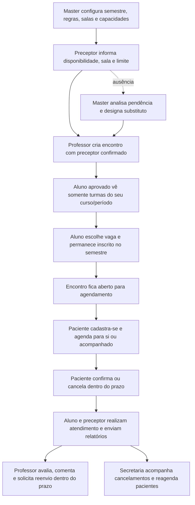

# Fluxo principal do sistema

## Sequência de segurança

1. A interface filtra as opções para orientar o usuário, mas a API repete a autorização, compatibilidade acadêmica, capacidade e conflito de agenda.
2. A reserva é confirmada em transação; duas pessoas disputando a última vaga não conseguem ocupá-la ao mesmo tempo.
3. Arquivos são armazenados no banco e baixados por uma rota privada que verifica a sessão e o vínculo com o registro.
4. O worker processa os lembretes e mensagens pendentes sem expor tokens de recuperação em notificações internas.
